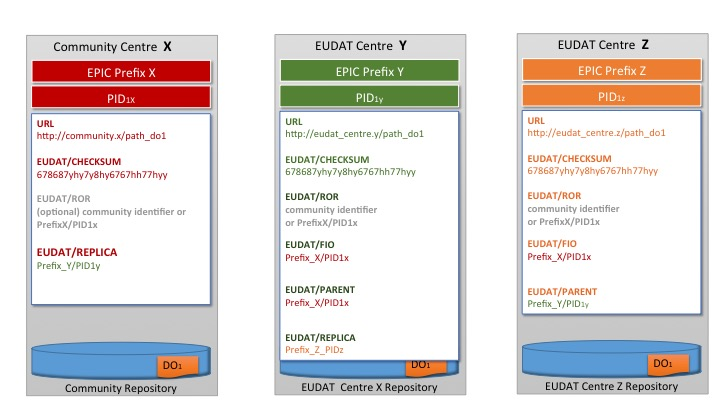

#Handout - iRODS, B2SAFE and B2STAGE-gridFTP

## PID profile


## Training Setup


Login to the user interface machine. This machine provides you with:

- icommands (iRODS, B2SAFE)
- globus-url-copy and uberFTP (gridFTP, B2STAGE-gridFTP)
- B2HANDLE python library (PID training)

```sh
ssh di4r-userX@145.100.59.156
```

## icommands for this training 

Command 	| Meaning
---------|--------
iinit		| Login
ienv		| iRODS environment
iuserinfo	| User attributes
**ihelp**		| List of all commands
**\<command\> -h** | Help
**Up- and down load**	|
iput	[-K -r -f -R \<resc\>]	| Upload data, create checksum, recursively, overwrite, specify resource
iget [-K -r -f]	| Check checksum, recursively, overwrite
**Data organisation** |
ils [-L -A -l] | List collection [Long format, Accessions, less long format]
imkdir		| Create collection
icd			| Change current working collection
**Metadata** 		|
imeta add [-d -C] Name AttName AttValue [AttUnits]	| Create metadata [file, collection]
imeta ls [-d -C]	| List metadata [file, collection]

## Basic icommands for up and download
### Login to iRODS

```sh
iinit

Enter the host name (DNS) of the server to connect to: 145.100.59.37
Enter the port number: 1247
Enter your irods user name: di4r-userX
Enter your irods zone: aliceZone
```
Password is the same as your unix-user password.

### Exercise (10 min)

- Data can be downloaded from iRODS to your local machine with the command *iget*.
Explore the command *iget* to **store the data in your home directory**. Do **not overwrite** your original data and **verify checksums**!

- Moving/renaming data. Rename the file in the collection lewiscarroll with the *imv* command. Check the physical path of the file before and after the renaming. 

- Why does the shell auto completion not work for files in iRODS?

## iRODS federations
You have access to another iRODS zone. You can list data like this:

```sh
ils -L /bobZone/home/di4r-userX#aliceZone
```

Synchronising data collections between iRODS zones:

```
irsync -r i:/aliceZone/home/di4r-user1/lewiscarroll \
i:/bobZone/home/di4r-user1#aliceZone/lewiscarroll
```

### Exercise 1
 
- Try to use *imv* to move *aliceInWonderland-DE.txt.utf-8* from *aliceZone* to *bobZone*. Can you use *icp*? What could be the reasoning for the different behaviour?

- Download the German version from *bobZone* to your local linux filesystem (store it under a different file name). Which commands can you use?

### Exercise 2 (20min)
Verify that *irsync* really just updates data when necessary.

1. Create a collection on *aliceZone*, e.g. *archive* or reuse the collection *lewiscarroll*
2. Add some (new) files to this collection, e.g. the English version of Alice in Wonderland (use *icp* or *imv* to move data from *aliceInWonderland*).
3. Check what needs to be synchronised with *irsync -l* flag. What does this flag do?
4. Synchronise the whole collection with *bobZone* (not only the file). Which flag do you have to use?
5. Check again if there is something to be synchronised.
6. Add another file to * aliceInWonderland* on *aliceZone*, e.g. the Italian version of Alice in Wonderland.
7. Check the synchronisation status. (It can take some time until the iRODS system marks the new files as 'synchronised')

### Metadata for remote data
#### Example

```
imeta add -d \
	/bobZone/home/di4r-userX#aliceZone/lewiscarroll/aliceInWonderland-DE.txt.utf-8 \
	"Original" \
	"/aliceZone/home/di4r-userX/lewiscarroll/aliceInWonderland-DE.txt.utf-8"
```
#### Exercise (5min)

Create some metadata for the remote collection *lewiscarroll* and its file.

- Link the remote collection to the local collection by creating a key-value pair ("Original", "/aliceZone/home/di4r-userX/lewiscarroll")
	
- Link the remote file in the collection *lewiscarroll* in the same way as above to its original.

## Automatic replication with B2SAFE
### iRODS rules
Example rules are listed in */home/di4r-userX/exampleRules*.

### Exercise: Local replication (5min)

Adopt the calling of the replication rule *examples/eudatRepl.r* to replicate aliceInWonderland to another collection in aliceZone, e.g. 'lewiscarroll/aliceIW'.

Inspect the metadata and PID handles of the original data aliceInWonderland.

### Exercise: Extending the replication chain

Now adopt the input to eudatReplication.r to replicate aliceIW from aliceZone back to bobZone.

- Inspect the metadata of lewiscarroll/aliceIW. How is it extended?
- How does the metadata of aliceIW at bobZone look like.
- It helps to draw a picture to keep track of the replication chain.

## B2STAGE

### CLI: globus-url-copy and uberftp

globus-url-copy  | uberftp | Meaning
------|------|-----
-help | -help |Help
-list | -ls |List directory
 |-cat| List contents of file
-p <n> | -parallel <n>
-r | -r (for deleting, transferring only single files) |Recurse
-cd | | Create destination upon transfer
 |-mkdir |Create remote directory
-sync, -sync-level |  |Synchronise data
-rm (-r)| -rmdir | Remove files and folders

### Examples

- List

```
globus-url-copy -list gsiftp://alice-server/<iRODS path or PID>/
```

- Copy from iRODS to unix directory

```
globus-url-copy -cd gsiftp://alice-server/<iRODS path or PID>/ NewCollGsi/
```

- Copy between iRODS server and gridFTP server

```
globus-url-copy -cd gsiftp://bob-server/<unix path>/ \
	gsiftp://alice-server/<iRODS path>/
```

**NOTE**, paths to folder always need to have a trailing '/'

### Exercise: Retrieving data from a remote iRODS zone (15min)
With iRODS we could access data on *aliceZone* and *bobZone*. However, we could not simply retrieve them by PID.

What happens if we try to list data on the two iRODS servers with gridFTP?
Try the following options, which work and why? Try both gridFTP clients, *globus-url-copy* and *uberftp*.

- List data in *aliceZone*
- List data in *bobZone* via the logical path with respect to *aliceZone*
- List data in *aliceZone* by PID (first get a PID pointing to data in iRODS with *imeta*)
- List data in *bobZone* by PID
 Why can the gridFTP server linked to *aliceZone* not retrieve the data? Inspect the PID URL entry.
